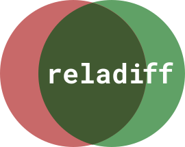

&nbsp;
<br/>
<br/>
<span style="font-size:1.3em">**Reladiff**</span> is a high-performance tool and library designed for diffing large datasets across databases. By executing the diff calculation within the database itself, Reladiff minimizes data transfer and achieves optimal performance.

This tool is specifically tailored for data professionals, DevOps engineers, and system administrators.

Reladiff is free, open-source, user-friendly, extensively tested, and delivers fast results, even at massive scale.

### Key Features:

 1. **Cross-Database Diff**: Reladiff employs a divide-and-conquer algorithm, based on matching hashes, to efficiently identify modified segments and download only the necessary data for comparison. This approach ensures exceptional performance when differences are minimal.

    - ⇄  Diffs across over a dozen different databases (e.g. *PostgreSQL* -> *Snowflake*) !

    - 🧠 Gracefully handles reduced precision (e.g., timestamp(9) -> timestamp(3)) by rounding according to the database specification.

    - 🔥 Benchmarked to diff over 25M rows in under 10 seconds and over 1B rows in approximately 5 minutes, given no differences.

    - ♾️ Capable of handling tables with tens of billions of rows.


2. **Intra-Database Diff**: When both tables reside in the same database, Reladiff compares them using a join operation, with additional optimizations for enhanced speed.

    - Supports materializing the diff into a local table.
    - Can collect various extra statistics about the tables.

3. **Threaded**: Utilizes multiple threads to significantly boost performance during diffing operations.

3. **Configurable**: Offers numerous options for power-users to customize and optimize their usage.

4. **Automation-Friendly**: Outputs both JSON and git-like diffs (with + and -), facilitating easy integration into CI/CD pipelines.

5. **Over a dozen databases supported**. MySQL, Postgres, Snowflake, Bigquery, Oracle, Clickhouse, and more. [See full list](https://reladiff.readthedocs.io/en/latest/supported-databases.html)


Reladiff is a fork of an archived project called [data-diff](https://github.com/datafold/data-diff).

## Get Started

[**🗎 Read the Documentation**](https://reladiff.readthedocs.io/en/latest/) - our detailed documentation has everything you need to start diffing.

## Quickstart

For the impatient ;)

### Install

Reladiff is available on [PyPI](https://pypi.org/project/reladiff/). You may install it by running:

```
pip install reladiff
```

Requires Python 3.8+ with pip.

We advise to install it within a virtual-env.

### How to Use

Once you've installed Reladiff, you can run it from the command-line:

```bash
# Cross-DB diff, using hashes
reladiff  DB1_URI  TABLE1_NAME  DB2_URI  TABLE2_NAME  [OPTIONS]
```

When both tables belong to the same database, a shorter syntax is available:

```bash
# Same-DB diff, using outer join
reladiff  DB1_URI  TABLE1_NAME  TABLE2_NAME  [OPTIONS]
```

Or, you can import and run it from Python:

```python
from reladiff import connect_to_table, diff_tables

table1 = connect_to_table("postgresql:///", "table_name", "id")
table2 = connect_to_table("mysql:///", "table_name", "id")

sign: Literal['+' | '-']
row: tuple[str, ...]
for sign, row in diff_tables(table1, table2):
    print(sign, row)
```

Read our detailed instructions:

* [How to use from the shell / command-line](https://reladiff.readthedocs.io/en/latest/how-to-use.html#how-to-use-from-the-shell-or-command-line)
    * [How to use with TOML configuration file](https://reladiff.readthedocs.io/en/latest/how-to-use.html#how-to-use-with-a-configuration-file)
* [How to use from Python](https://reladiff.readthedocs.io/en/latest/how-to-use.html#how-to-use-from-python)


#### "Real-world" example: Diff "events" table between Postgres and Snowflake

```
reladiff \
  postgresql:/// \
  events \
  "snowflake://<username>:<password>@<password>/<DATABASE>/<SCHEMA>?warehouse=<WAREHOUSE>&role=<ROLE>" \
  events \
  -k event_id \         # Identifier of event
  -c event_data \       # Extra column to compare
  -w "event_time < '2024-10-10'"    # Filter the rows on both dbs
```

#### "Real-world" example: Diff "events" and "old_events" tables in the same Postgres DB

Materializes the results into a new table, containing the current timestamp in its name.

```
reladiff \
  postgresql:///  events  old_events \
  -k org_id \
  -c created_at -c is_internal \
  -w "org_id != 1 and org_id < 2000" \
  -m test_results_%t \
  --materialize-all-rows \
  --table-write-limit 10000
```

#### More examples

<p align="center">
  
</p>

<p align="center">
  <a href=https://www.loom.com/share/682e4b7d74e84eb4824b983311f0a3b2 target="_blank">
    
  </a>
</p>


### Technical Explanation

Check out this [technical explanation](https://reladiff.readthedocs.io/en/latest/technical-explanation.html) of how reladiff works.

### We're here to help!

* Confused? Got a cool idea? Just want to share your thoughts? Let's discuss it in [GitHub Discussions](https://github.com/erezsh/reladiff/discussions).

* Did you encounter a bug? [Open an issue](https://github.com/erezsh/reladiff/issues).

## How to Contribute
* Please read the [contributing guidelines](https://github.com/erezsh/reladiff/blob/master/CONTRIBUTING.md) to get started.
* Feel free to open a new issue or work on an existing one.

Big thanks to everyone who contributed so far:

<a href="https://github.com/erezsh/reladiff/graphs/contributors">
  
</a>


## License

This project is licensed under the terms of the [MIT License](https://github.com/erezsh/reladiff/blob/master/LICENSE).
